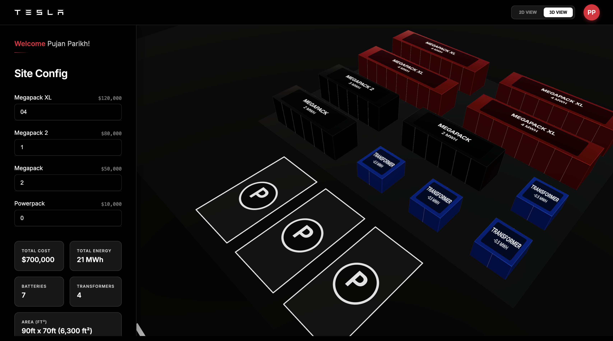
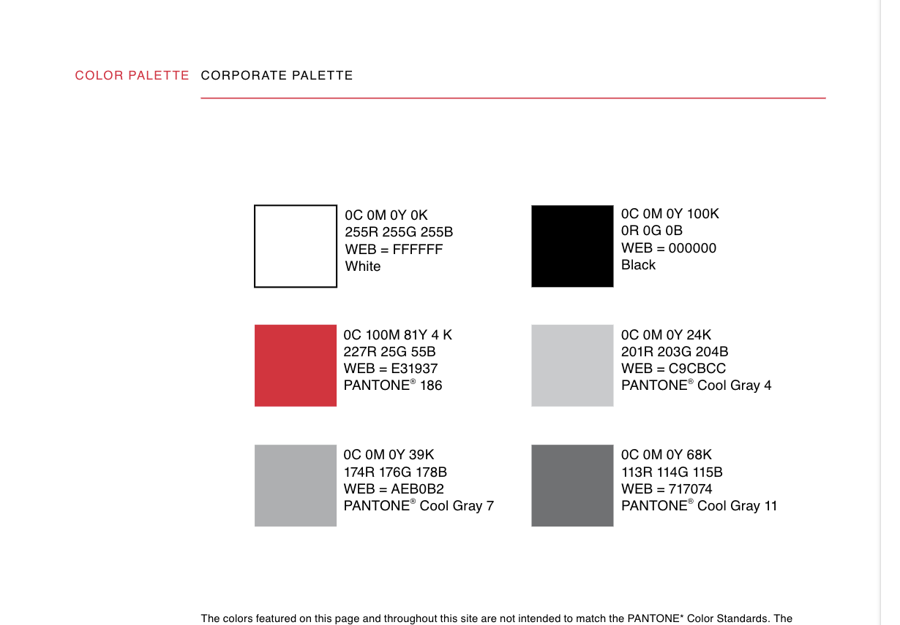

# Tesla Energy Site Layout Planner

## 🔗 Live Deployment
The latest production build is accessible at:
[**https://tesla-dashboard-lqcu.onrender.com/**](https://tesla-dashboard-lqcu.onrender.com/)

An industrial-grade, full-stack application for utility-scale battery deployment planning. This ecosystem enables energy engineers to architect, optimize, and visualize Megapack and Powerpack sites with high-fidelity 2D/3D interfaces and an intelligent hardware packing engine.



## 🚀 Key Features

- **Intelligent Density Optimization**: Real-time hardware placement using a **First-Fit Packing Algorithm**. This ensures smaller units (like Transformers) automatically fill gaps in larger Megapack rows, maximizing site capacity.
- **Dual-Mode High-Fidelity UI**: Seamless switching between a technical 2D layout and a high-performance **Three.js 3D View** with industrial dark-mode aesthetics.
- **Automated Hardware Inventory**: Dynamic cost and energy calculations based on the selected configuration of Megapacks (XL, 2, standard) and Powerpacks.
- **Globalized Experience (i18n)**: Native support for English, Spanish, and French, ensuring the platform is ready for international energy markets.
- **Enterprise-Grade Security**: Stateless JWT authentication with persistent session management and secure type-safe Monorepo architecture.

## 🎨 Design Language & Aesthetic

The Tesla Energy Site Layout Planner follows a precision-engineered **Industrial Premium** visual identity. Every UI element is designed to minimize cognitive load while maintaining an aesthetic "Wow" factor.



### Core Visual Pillars:
- **High-Contrast Industrial Dark Mode**: Optimized for long-term engineering focus, using deep #080808 backgrounds with high-legibility #f0f0f0 text.
- **Precision Typography**: Leveraging clean, geometric sans-serif typefaces (Inter and Roboto) for technical data clarity and hardware inventory readability.
- **Technical Color Palette**: Strategic use of **Tesla Red** (#E01E35) as a primary accent for critical CTAs and industrial status indicators, alongside a grayscale foundation that reflects structural energy infrastructure.
- **3D-First Experience**: Using Three.js to provide a seamless transition from abstract design to realistic spatial visualization.

## 🏗️ Technical Architecture

The project is built as an **NPM Workspace Monorepo**, ensuring that the backend (Express) and frontend (React) share a single source of truth for all data models.

- **Monorepo Strategy**: Uses `@tesla/shared` for all data definitions, preventing type discrepancies across the full stack.
- **Styling**: Pure **CSS Modules** for maximum performance and isolation, avoiding global stylesheet pollution.
- **Database**: **MongoDB** with Mongoose ORM for a JSON-native, agile development cycle.
- **Infrastructure**: Automated deployments via **Render.com** mapping the monorepo logic directly to production environments.

## 🛠️ Quick Start (Developer Setup)

Thanks to the automated bootstrap system, you can set up the entire environment with a single command after cloning:

```bash
# Clone the repo
git clone https://github.com/pujan1/tesla-energy-planner.git
cd tesla-energy-planner

# Bootstrap the entire ecosystem (Install + Config + Build + Start)
npm run bootstrap
```

This command will:
1. Install all dependencies across the monorepo.
2. Seed the backend environment from the `.env.example` template.
3. Compile the `@tesla/shared` TypeScript definitions.
4. Launch both the backend and frontend development servers concurrently.

## 🧪 Testing & Reliability

The platform is verified against strict industrial requirements using a dual-tier testing strategy. You can run all suites directly from the project root:

- **Full Suite**: `npm test` runs all unit tests across the monorepo.
- **Frontend Unit**: `npm run test:frontend` executes React-specific Jest suites for hardware logic.
- **Backend Unit**: `npm run test:backend` runs Express unit and API endpoint tests (Jest).
- **E2E Suite**: `npm run test:e2e` executes the full user-flow verification using **Playwright**.

```bash
# Run all unit tests
npm test

# Run Playwright E2E suite
npm run test:e2e
```

## 🌍 Supported Languages
- 🇺🇸 English
- 🇪🇸 Spanish
- 🇫🇷 French

---

## ⚠️ Known Issues & Engineering Constraints

While the platform is highly stable for layout planning, we are tracking the following technical limitations:

### 1. 3D Viewport Artifacts
- **Clipping**: Minor Z-fighting and geometry clipping occur in the 3D viewer, particularly near the road/concrete boundary when viewing from extreme low angles.
- **Dark Mode Contrast**: The 3D scene lighting in "Night" mode currently results in a very high-contrast shadow profile that can obscure device labels in deep shadows.

### 2. Manual Mode Constraints
- **100ft Width Safety**: While the auto-arrange engine strictly adheres to the default 100ft site width, entering **Manual Edit Mode** allows engineers to exceed this boundary for custom logistical requirements. This can result in a "Warning" state in the sidebar if not manually balanced.

### 3. Device Responsiveness
- **Mobile 3D Viewer**: The Three.js canvas is currently optimized for desktop performance. Users on smaller mobile devices may experience lower frame rates (FPS) and simplified gesture controls in the 3D Tab.

---

## 🚀 Future Enhancements & Roadmap

We are continuously evolving the site planner ecosystem with upcoming professional features:

### 1. Advanced Analytics & Audit Dashboard
- **Engagement Tracking**: Implementation of an audit event system to track user clicks, session durations, and click-through rates (CTR) on hardware inventory items.
- **Design Telemetry**: An analytics dashboard for sales teams to visualize common site configurations and popular hardware mixes.

### 2. Immersive 3D Editing
- **Interactive Scene**: Transitioning the 3D viewer from a read-only visualizer to a full interactive canvas. This will allow engineers to add, arrange, and delete Megapacks directly within the 3D environment.
- **Aesthetic Refinements**: Collaborating with UI/UX teams to finalize the industrial color palette and lighting models for a more accurate digital twin appearance.

---
© 2026 Tesla Energy UI Engineering. All rights reserved.
